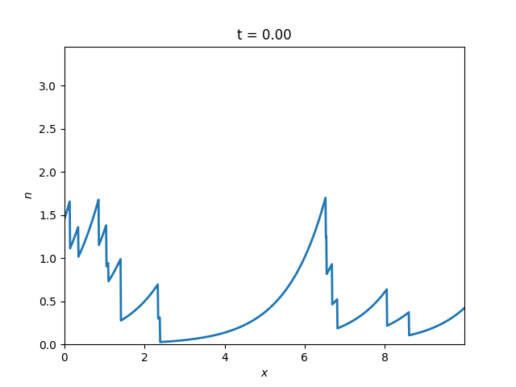

[](http://mypy-lang.org/)
[](https://codecov.io/gh/uit-cosmo/2d_propagating_blobs)
[](https://sourcery.ai)
# 2d_propagating_blobs
Two dimensional model of advecting and dissipating blobs.

The code has been developed originally to model profiles in the scrape-off layer of fusion experiments but it can be used to model any 1d or 2d system consisting of advecting pulses. Examples for one and two dimensions are shown below:



## Installation
The package is published to PyPI and can be installed with
```sh
pip install blobmodel
```

If you want the development version you must first clone the repo to your local machine,
then install the project in development mode:

```sh
git clone git@github.com:uit-cosmo/2d-propagating-blobs.git
cd 2d-propagating-blobs
poetry install
```

## Usage
Create the grid on which the blobs are discretized with using the `Model` class. The `make_realization()` method computes the output as an xarray dataset which can also be written out as a `netcdf` file if the argument `file_name` is specified. A simple example is shown below:

```Python
from blobmodel import Model, show_model

bm = Model(Nx=200, Ny=100, Lx=10, Ly=10, dt=0.1, T=20, blob_shape='gauss',num_blobs=100)

ds = bm.make_realization(file_name="example.nc")
```
The data can be shown as an animation using the `show_model` function:
```Python
show_model(ds)
```
You can specify the blob parameters with a BlobFactory class. The DefaultBlobFactory class has some of the most common distribution functions implemented. An example would look like this:
```Python
from blobmodel import Model, DefaultBlobFactory

# use DefaultBlobFactory to define distribution functions fo random variables
bf = DefaultBlobFactory(A_dist="exp", W_dist="uniform", vx_dist="deg", vy_dist="normal")

# pass on bf when creating the Model
tmp = Model(
    Nx=100,
    Ny=1,
    Lx=10,
    Ly=0,
    dt=1,
    T=1000,
    blob_shape="exp",
    t_drain=2,
    periodic_y=False,
    num_blobs=10000,
    blob_factory=bf,
)
```
Alternatively, you can specify all blob parameters exactly as you want by writing your own class which inherits from BlobFactory. See `examples/custom_blobfactory.py` as an example. 
## Input parameters
### `Model()`
- `Nx`: int, grid points in x
- `Ny`: int, grid points in y
- `Lx`: float, length of grid in x
- `Ly`: float, length of grid in y
- `dt`: float, time step 
- `T`: float, time length 
- `periodic_y`: bool, optional,
            allow periodicity in y-direction 
            
            !!!  this is only a good approximation if Ly is significantly bigger than blobs  !!!
- `blob_shape`: str, optional,
            switch between `gauss` and `exp` blob
- `num_blobs`: int, optional
            number of blobs
- `t_drain`: float, optional,
            drain time for blobs 
- `blob_factory`: BlobFactory, optional,
            object containing blob parameters
- `labels`: str, optional,
            "off": no blob labels returned,
            "same": regions where blobs are present are set to label 1,
            "individual": different blobs return individual labels,
            used for creating training data for supervised machine learning algorithms
- `label_border`: float, optional,
            defines region of blob as region where density >= label_border * amplitude of Blob
            only used if labels = True
### `DefaultBlobFactory()`
- `A_dist`: str, optional,
            distribution of blob amplitudes
- `W_dist`: str, optional,
            distribution of blob widths
- `vx_dist`: str, optinal,
            distribution of blob velocities in x-dimension
- `vy_dist`: str, optinal,
            distribution of blob velocities in y-dimension
- `A_parameter`: float, optional,
            `free_parameter` for amplitudes
- `W_parameter`: float, optional,
            `free_parameter` for widths
- `vx_parameter`: float, optional,
            `free_parameter` for vx
- `vy_parameter`: float, optional,
            `free_parameter` for vy
            
The following distributions are implemented:

- `exp`: exponential distribution with mean 1
- `gamma`: gamma distribution with `free_parameter` as shape parameter and mean 1
- `normal`: normal distribution with zero mean and `free_parameter` as scale parameter
- `uniform`: uniorm distribution with mean 1 and `free_parameter` as width
- `ray`: rayleight distribution with mean 1
- `deg`: array on ones
- `zeros`: array of zeros
### `make_realization()`
- `file_name`: str, optional, 
            file name for .nc file containing data as xarray dataset
- `speed_up`: bool, optional,
            speeding up code by discretizing each single blob at smaller time window 
            when blob values fall under given error value the blob gets discarded 

            !!!  this is only a good approximation for blob_shape='exp' !!!
- `error`: float, optional,
            numerical error at x = Lx when blob gets truncated 
### `show_model()`
- `ds`: xarray Dataset,
            Model data
- `interval`: int, optional,
            time interval between frames in ms
- `save`: bool, optional,
            if True save animation as gif
- `gif_name`: str, optional,
            set name for gif
- `fps`: int, optional,
            set fps for gif

## Contact
If you have questions, suggestions or other comments you can contact me under gregor.decristoforo@uit.no

