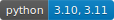

# blobmodel  

[](https://www.python.org/)
[](https://pypi.org/project/blobmodel/#description)
[](https://codecov.io/github/uit-cosmo/blobmodel)

[](http://mypy-lang.org/)
[](https://github.com/psf/black)
[](https://opensource.org/licenses/MIT)
[](https://blobmodel.readthedocs.io/en/latest/?badge=latest)

This package provides realizations of advecting and dissipating blobs in up to two dimensions. 

All blob parameters can be choosen freely, and multiple blob shapes are implemented. Originally, the model is developed for studying the scrape-off layer of fusion experiments, but it can be applicable to many 1d or 2d systems. See the [blobmodel documentation](https://blobmodel.readthedocs.io/en/latest/?badge=latest) for further details.

Examples for one and two dimensions are shown below:

<table>
<tr>
<th> 1D </th>
<th> 2D </th>
</tr>
<tr>
<td>


</td>
<td>


</td>
</tr>
</table>

## Installation
The package is published to PyPI and can be installed with
```sh
pip install blobmodel
```

If you want the development version you must first clone the repo to your local machine,
then install the project in development mode:

```sh
git clone https://github.com/uit-cosmo/blobmodel.git
cd blobmodel
python -m pip install -e .
```

## Usage
Create a grid on which the blobs are discretized using the `Model` class. The `make_realization()` method computes the output as an xarray dataset which can also be written out as a `netcdf` file if the argument `file_name` is specified. A simple example is shown below:

```Python
from blobmodel import Model, show_model

bm = Model(Nx=200, Ny=100, Lx=10, Ly=10, dt=0.1, T=20, num_blobs=100)

ds = bm.make_realization(file_name="example.nc")
```
The data can be shown as an animation using the `show_model` function:
```Python
show_model(ds)
```
You can specify the blob parameters with a BlobFactory class. The DefaultBlobFactory class has some of the most common distribution functions implemented. An example would look like this:

```Python
from blobmodel import DefaultBlobFactory, DistributionEnum, Model

# use DefaultBlobFactory to define distribution functions of random variables
my_blob_factory = DefaultBlobFactory(A_dist=DistributionEnum.normal, A_parameter=5)

# pass on my_blob_factory when creating the Model
bm = Model(
        Nx=100,
        Ny=100,
        Lx=10,
        Ly=10,
        dt=0.1,
        T=20,
        blob_factory=my_blob_factory,
        t_drain=100,
        num_blobs=100,
    )
```
Alternatively, you can specify all blob parameters exactly as you want by writing your own class which inherits from BlobFactory. See `examples/custom_blobfactory.py` as an example or take a look at the [blobmodel documentation](https://blobmodel.readthedocs.io/en/latest/?badge=latest).

## Contributing

Feel free to raise issues about anything. Contributions through pull requests are also very welcome. Please take a look at our [Contributor guide](https://blobmodel.readthedocs.io/en/latest/contributor_guide.html) for further details.
