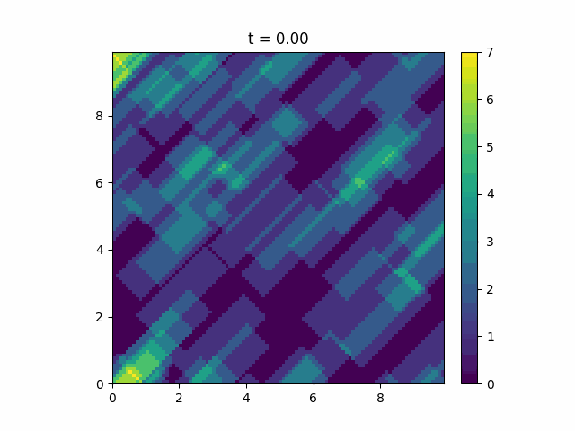
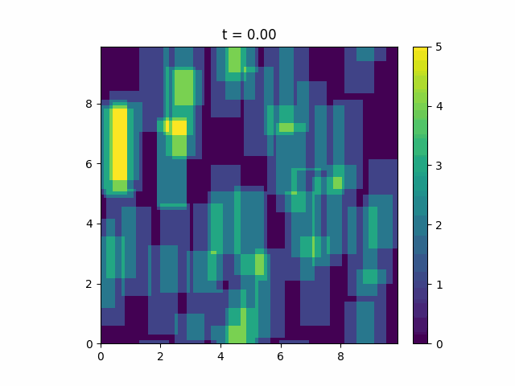

.. _blob-alignment:

Blob Alignment
==============

By default, the blob shape is rotated to its propagation direction. The rotation angle :math:`\theta` is calculated as ``cmath.phase(vx + vy * 1j)``.

An example of a rotated blob is shown below.

Alternatively, we can force :math:`\theta = 0` for all blobs. The blob propagation direction won't be affected but the blob shape stays orientated towards x and y.
We achieve this by setting ``blob_alignment`` to False when the ``Blob`` object is instantiated. 
If you want to implement a whole ``Model`` with unaligned blobs you need to use the ``CustomBlobFactory`` since blob alignment is not handled on a ``Model`` level.

Instantiating a single blob as follows results in a unaligned blob:

.. code-block:: python

  from blobmodel import Blob

  Blob(
      blob_id=0,
      blob_shape="exp",
      amplitude=1,
      width_prop=1,
      width_perp=1,
      v_x=1,
      v_y=1,
      pos_x=0,
      pos_y=5,
      t_init=0,
      t_drain=1e10,
  )

