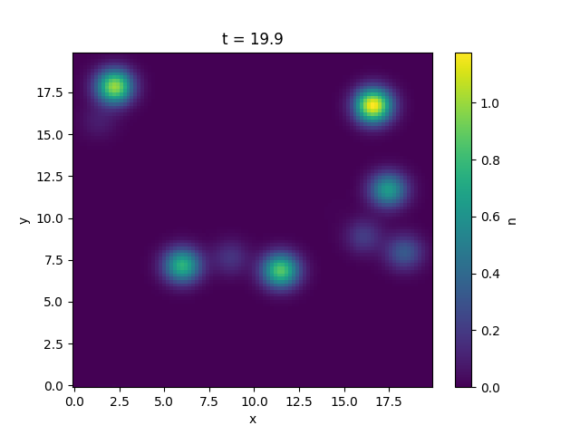

.. _blob-lables:
   
Blob labels
===========

We can create an additional field showing blob labels by setting the ``labels`` argument to either ``same`` or ``individual`` when instantiating the ``Model`` object. 
``same`` will label regions where blobs are present to 1 and the background to zero. ``individual`` will give individual integers as labels for each blob.
The resulting filed will be stored as ``blob_labels`` in the xarray dataset. This option can be useful for creating a training dataset for supervised machine learning algorithms.

The borders of the blob labels are defined with the ``label_border`` argument. The label regions are located where ``density >= label_border * amplitude``.

Let's take a look at an example: Let's say we want to calculate the individual blob labels of some Gaussian blobs:

.. literalinclude:: ../tests/test_docs.py
   :language: python
   :start-after: # PLACEHOLDER blob_labels_0
   :end-before: # PLACEHOLDER blob_labels_1

|pic1| |pic2|

.. |pic2| image:: labels_labels.png
   :width: 49%
