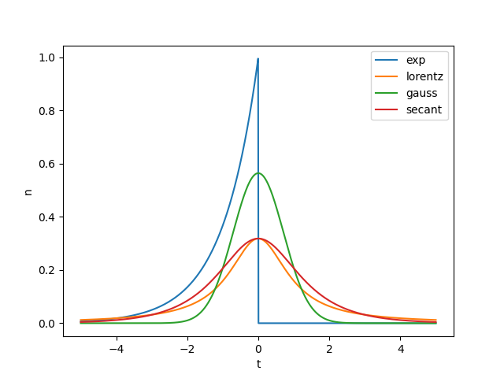
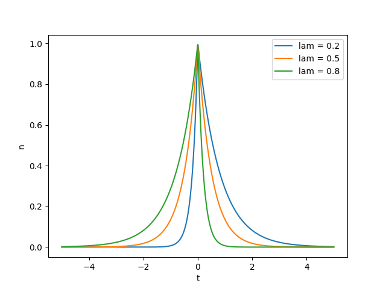

.. _blob-shapes:
   

Blob Shapes
===========

We can choose between four different blob shapes that are specified with the ``blob_shape`` argument of the ``Model`` class.

The blob shape consists of two parts, the blob shape in the propagation direction and the blob shape in the perpendicular direction thereof.
The propagation direction is calculated from vx and vy of each individual blob (see :ref:`blob-alignment` for further details).

The ``blob_shape`` argument should implement the ``AbstractBlobShape`` class. For most cases it suffices to use the standard implementation
``BlobShapeImpl``, instantiated as

.. code-block:: python
    BlobShapeImpl(pulse_shape_prop, pulse_shape_perp)
Where ``pulse_shape_prop`` and ``pulse_shape_perp`` indicate the pulse shape in the propagation and perpendicular
direction, respectively. These arguments are ``BlobShapeEnum`` typed, and can take the following values, where
:math:`\theta` represents a coordinate in either the propagation or perpendicular direction.

.. list-table:: 
   :widths: 10 10 10 10 10 10 10
   :header-rows: 1

   * - exp
     - lorentz
     - double_exp
     - gaussian
     - secant
     - dipole
     - rect
   * - Exponential
     - Lorentz
     - Double Exponential
     - Gaussian
     - Secant
     - Dipole
     - Rectangular
   * - :math:`e^\theta \Theta(-\theta)`
     - :math:`\frac{1}{\pi(1+\theta^2)}`
     - :math:`e^{\theta/\lambda} \Theta(-\theta) + e^{\theta/(1-\lambda)} \Theta(\theta)`
     - :math:`\frac{e^{-\theta^2/2}}{\sqrt{\pi}}`
     - :math:`\frac{2}{\pi (e^\theta + e^{-\theta})}`
     - :math:`\frac{-2 \theta e^{-\theta^2}}{\sqrt{\pi}}`
     - :math:`\Theta(|\theta|-1/2)`

The following example creates a `Model` with a pulse shape given by an exponential in the propagation direction, and
lorentzian in the perpendicular direction:

.. literalinclude:: ../tests/test_docs.py
   :language: python
   :start-after: # PLACEHOLDER blob_shapes_0
   :end-before: # PLACEHOLDER blob_shapes_1

++++++++++++++++++++++++++++++++
Two-sided exponential blob shape
++++++++++++++++++++++++++++++++

The last blob shape we discuss is the two-sided exponential blob shape. In contrast to the shapes above, it requires an asymmetry parameter ``lam`` to specify the exact shape.
The shape is implemented as follows:

.. code-block:: python

  shape[t < 0] = np.exp(t[t < 0] / lam)
  shape[t >= 0] = np.exp(-t[t >= 0] / (1 - lam))

We specify the asymmetry parameter when defining the ``blob_factory``. An example would look like this:

.. literalinclude:: ../tests/test_docs.py
   :language: python
   :start-after: # PLACEHOLDER blob_shapes_1
   :end-before: # PLACEHOLDER blob_shapes_2

Take a look at ``examples/2_sided_exp_pulse.py`` for a fully implemented example.
