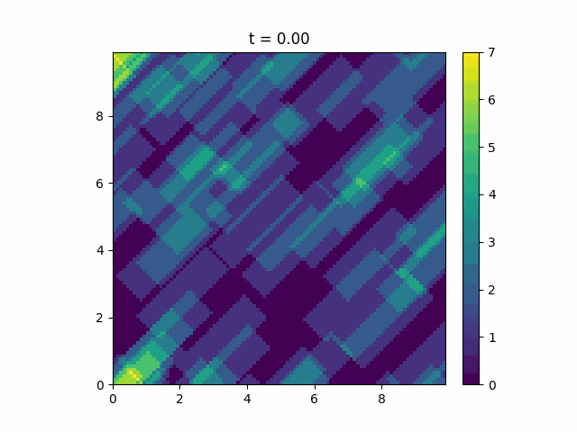
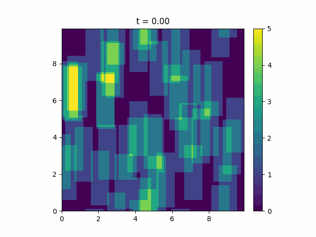

.. _blob-tilt:

Blob tilt
==============

The code for generating the realizations presented in this file is located in examples/blob_tilting.py

The blob shape can be rotated to its propagation direction by setting the ``blob_alignment``
attribute to True (both ``Blob`` and ``DefaultBlobFactory`` default it to False). In that case the
rotation angle :math:`\theta` is calculated as ``cmath.phase(vx + vy * 1j)``.

An example of a realization with aligned blobs is shown below.

Alternatively, we can set any tilt angle explicitly. With a ``DefaultBlobFactory``, leave ``blob_alignment`` False (the default, shown explicitly here):

.. literalinclude:: ../tests/test_docs.py
   :language: python
   :start-after: # PLACEHOLDER blob_tilt_0
   :end-before: # PLACEHOLDER blob_tilt_1

Then the tilt will be given by the argument theta. Which, if using a ``DefaultBlobFactory``, can be set by

.. literalinclude:: ../tests/test_docs.py
   :language: python
   :start-after: # PLACEHOLDER blob_tilt_1
   :end-before: # PLACEHOLDER blob_tilt_2

Setting the angle with a lambda allows us to set a distribution of tilt angles. In this case we use a degenerate distribution:
The blob propagation direction won't be affected. The resulting realization is shown below:

