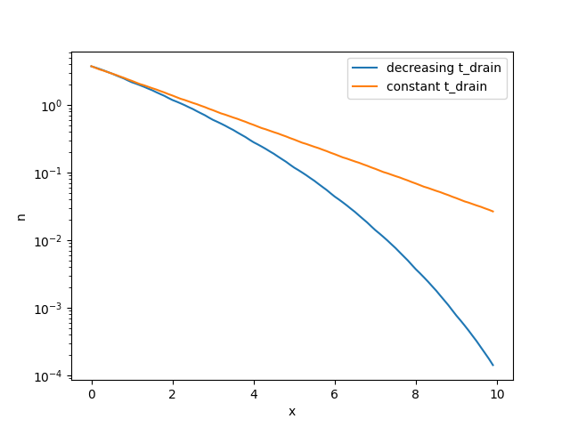

.. _drainage-time:

Drainage Time
=============

Blob draining is owned by the blob factory: ``DefaultBlobFactory`` takes a ``t_drain`` argument which it assigns to every sampled blob.
By default ``t_drain`` is ``np.inf``, i.e. the blobs do not drain. Setting it to an integer or float gives a constant drainage time in the whole domain.
We can also set ``t_drain`` to an array like of length ``Nx``. In this case ``t_drain`` will vary accordingly with x.

Let's take a look at a quick example. Let's assume we want ``t_drain`` to decrease linearly with x. We could implement this as follows:

.. literalinclude:: ../tests/test_docs.py
   :language: python
   :start-after: # PLACEHOLDER drainage_time_0
   :end-before: # PLACEHOLDER drainage_time_1

The time averaged x-profile of ``n`` compared to a constant ``t_drain`` = 2 would then look like this:

