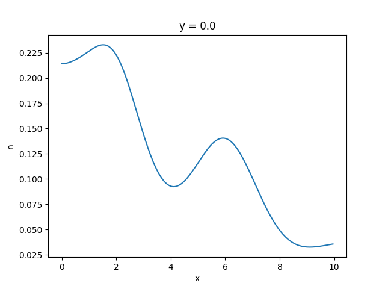

.. _getting-started:
   
Getting Started
===============

++++++++++++++++
Creating a model
++++++++++++++++

We create a grid on which the blobs are discretized with using the ``Model`` class. Here, we specify the geometry of the model by the number of grid points, the lengths of the domain, the time step, the time length and the initial time of our realization.

In addition, we can specify the blob shape, drainage time and the number of blobs when creating a ``Model`` object. For more details about the geometry, take a look at the :ref:`blobmodel-geometry` section.

.. literalinclude:: ../tests/test_docs.py
   :language: python
   :start-after: # PLACEHOLDER getting_started_0
   :end-before: # PLACEHOLDER getting_started_1

+++++++++++++++++
Superposing blobs
+++++++++++++++++

We can now call the ``make_realization()`` method to sum up the individual blobs. The blob parameters are sampled from the according distribution functions (see :ref:`parameter-distributions` for further details).
If we provide a ``file_name`` to the ``make_realization`` method, it will store the realization under this name on your machine. 

.. literalinclude:: ../tests/test_docs.py
   :language: python
   :start-after: # PLACEHOLDER getting_started_1
   :end-before: # PLACEHOLDER getting_started_2

The ``make_realization`` method can take two more arguments, ``speed_up`` and ``error``, which can be helpful for integrating very large datasets.
By setting ``spee_up`` to ``True``, the code will truncate the blobs when the blob values fall under the given ``error`` value. 
The code assumes an exponential shape for the blobs when calculating the truncation position (see :ref:`blob-shapes` for further details).
Increasing the spatial resolution (the `Nx` and `Ny` arguments in the `Model) will lead to something like this:

.. image:: 2d_animation.gif
   :alt: StreamPlayer
   :align: center
   :scale: 80%

Such animation can be plotted with the following code:

.. code-block:: python

    from blobmodel import show_model
    show_model(dataset=ds, interval=100, gif_name="2d_animation.gif", fps=10)

Here, all the blobs move with the same speed and have the same shape and size. We will learn how to set distribution functions for the blobs parameters in :ref:`parameter-distributions`

The ``make_realization`` method returns the realization in the form of an `xarray dataset <https://docs.xarray.dev/en/stable/index.html>`_. 
The superposed pulses are stored in the ``n`` variable of the dataset. The dimension coordinates are ``x``, ``y`` and
``t`` for the horizontal, vertical and time coordinate, respectively.

We can now analyse the data using the convenient xarray syntax, for example:

.. literalinclude:: ../tests/test_docs.py
   :language: python
   :start-after: # PLACEHOLDER getting_started_2
   :end-before: # PLACEHOLDER getting_started_3

