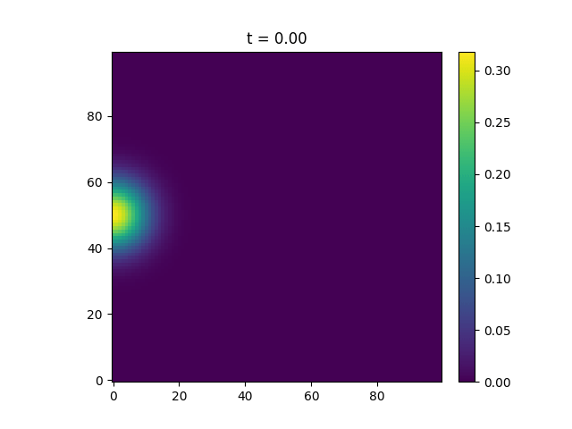

.. _blobmodel-geometry:

Model Geometry
==============

In addition to setting the domain and grid size, the ``Model`` class provides some additional functionality.

+++++++++++++
y-periodicity
+++++++++++++

By setting the ``periodic_y`` argument of the ``Model`` class to ``True``, blobs that propagate out of the domain in the ``y`` direction enter at the opposite end. 

.. note::

   Using ``periodic_y`` is only a good idea if the domain size in y is large compared to the blob widths since the periodicity is implemented by adding additional "ghost blobs" outside of the domain.
   The code will give a warning if the blob width is less than ``0.1 * Ly``.

++++++++
1D model
++++++++

By setting the ``one_dimensional`` argument of the ``Model`` class to ``True``, the perpendicular shape of the blobs will be discarded (see :ref:`blob-shapes` for further information). 
The parameters for the y-component (Ny and Ly) will be overwritten to ``Ny=1`` and ``Ly=0``.

