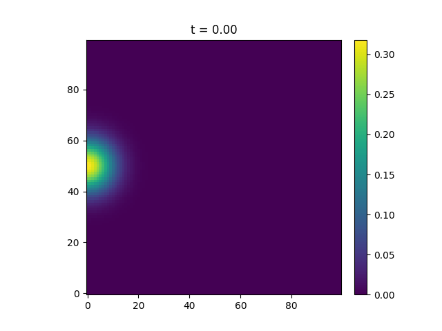

.. _blobmodel-geometry:

Model Geometry
==============

The grid is defined by the ``Geometry`` class and passed to the ``Model`` with the ``geometry`` argument. If no geometry is provided, a default ``Geometry()`` is used. The geometry of a model is accessible read-only as ``model.geometry``.

++++++++++++++
Domain origin
++++++++++++++

By default the domain is ``[0, Lx) x [0, Ly)`` with time ``[t_init, T)``. The ``x0`` and ``y0`` arguments of ``Geometry`` shift the domain origin, e.g. ``Geometry(Lx=10, x0=-5)`` gives an x-domain centered on 0. Blob positions are absolute coordinates: offsetting the domain moves the observation window, it does not shift the blobs. ``t_init`` may likewise be negative (e.g. ``t_init=-T`` centers the time grid on 0).

+++++++++++++++++++++++++++++
Building a grid from arrays
+++++++++++++++++++++++++++++

If you already have coordinate arrays, ``Geometry.from_arrays(x, y, t)`` builds a geometry directly from them, deriving the grid invariants and validating that the arrays are uniformly spaced:

.. code-block:: python

    import numpy as np
    from blobmodel import Geometry, Model

    x = np.arange(-5, 5, 0.1)
    y = np.arange(-5, 5, 0.1)
    t = np.arange(-50, 50, 0.5)
    bm = Model(geometry=Geometry.from_arrays(x, y, t))

+++++++++++++
y-periodicity
+++++++++++++

By setting the ``periodic_y`` argument of the ``Geometry`` class to ``True``, blobs that propagate out of the domain in the ``y`` direction enter at the opposite end.

.. note::

   Using ``periodic_y`` is only a good idea if the domain size in y is large compared to the blob widths since the periodicity is implemented by adding additional "ghost blobs" outside of the domain.
   The code will give a warning if the blob width is less than ``0.1 * Ly``.

++++++++
1D model
++++++++

By setting the ``one_dimensional`` argument of the ``Model`` class to ``True``, the perpendicular shape of the blobs will be discarded (see :ref:`blob-shapes` for further information).
The default geometry is adjusted to ``Ny=1`` and ``Ly=0`` in this case; a user-provided geometry must already fulfil ``Ny=1`` and ``Ly=0``.

