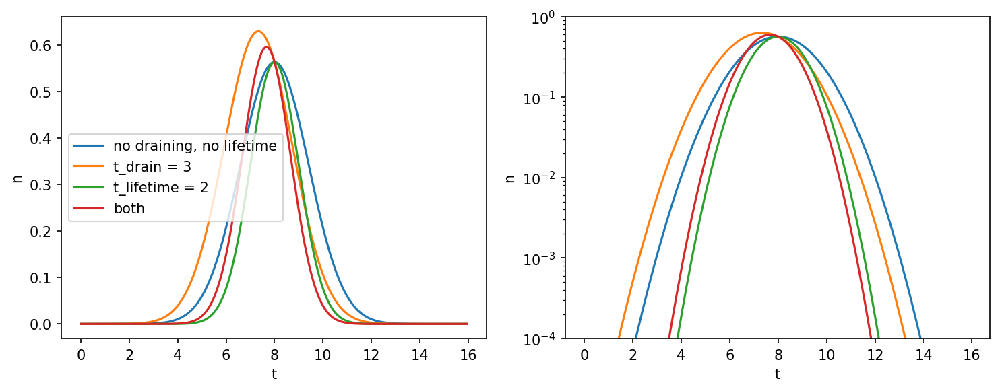

.. _pulse-lifetime:

Pulse Lifetime
==============

In addition to the drainage time, a blob can be given a finite *pulse lifetime* ``t_lifetime``, which multiplies it by the Gaussian envelope

.. math::

   \exp\left[-\left(\frac{t - t_k}{\tau_\mathrm{d}}\right)^2\right],

where :math:`t_k` is the blob's ``t_init``. Unlike ``t_drain``, which is a one-sided exponential decay *from* :math:`t_k`, this envelope is *symmetric about* :math:`t_k`: the blob grows, peaks at :math:`t_k` and decays again. The two factors are independent and multiply, so a blob can have both.

``t_lifetime`` is ``None`` by default, which means no envelope at all. It is a scalar: unlike ``t_drain`` there is no per-``x`` array form.

Like the drainage time, the pulse lifetime is owned by the blob factory: ``DefaultBlobFactory`` takes a ``t_lifetime`` argument which it assigns to every sampled blob.

.. literalinclude:: ../tests/test_docs.py
   :language: python
   :start-after: # PLACEHOLDER pulse_lifetime_0
   :end-before: # PLACEHOLDER pulse_lifetime_1

The time trace of a single blob passing a fixed point, with and without draining and a lifetime, is shown below on linear and logarithmic scales. Draining makes the pulse asymmetric and shifts its maximum to earlier times, while the lifetime narrows it symmetrically around ``t_init``:

Seeding blobs across the domain
-------------------------------

``DefaultBlobFactory`` seeds every blob at ``pos_x0 = 0`` by default. With a finite lifetime that puts every pulse maximum at the inflow edge, and the signal further into the domain is suppressed by the envelope. A homogeneous process therefore needs blobs seeded across the domain, which is what the ``"posx"`` sampler is for.

The factory does not know the geometry, so the seeding interval is supplied by the caller — who does know it, having built the ``Geometry``. Seeding over an interval *wider* than the observed domain, by a few times :math:`\bar{v}\tau_\mathrm{d}`, keeps the process homogeneous over the whole observation window:

.. code-block:: python

   pad = 10.0
   blob_factory.set_sampler("posx", lambda rng, n: rng.uniform(geometry.x0 - pad, geometry.x0 + geometry.Lx + pad, n))

With uniform seeding, a finite lifetime and a long enough domain, the mean and variance of the resulting process are independent of the velocity distribution.
